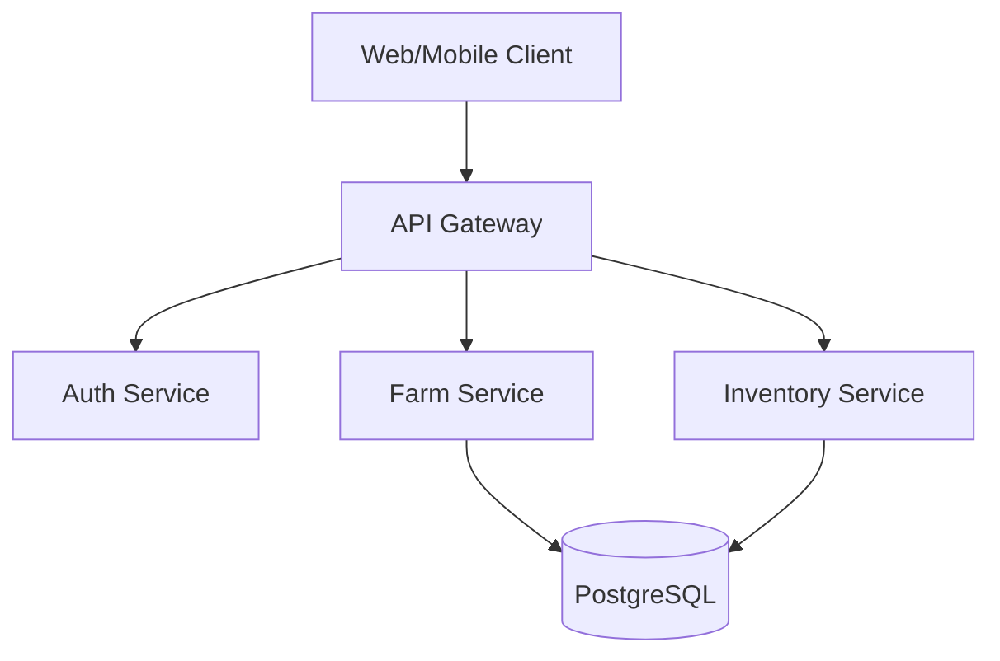

# Software Architecture Best Practices for Unified Systems
## Production-Ready Patterns to Prevent Fragmentation

*Research compiled: January 2026*

---

## Table of Contents
1. [API Gateway Patterns](#1-api-gateway-patterns)
2. [Event-Driven Architecture](#2-event-driven-architecture)
3. [Domain-Driven Design](#3-domain-driven-design)
4. [Feature Flag Systems](#4-feature-flag-systems)
5. [Documentation as Code](#5-documentation-as-code)
6. [Dependency Management](#6-dependency-management)
7. [Recommended Tool Stack](#7-recommended-tool-stack)

---

## 1. API Gateway Patterns

### How Unified API Gateways Work

An API gateway sits between clients and your microservices, acting as a **single entry point** for all requests. Instead of clients calling each service directly, the gateway:

1. **Routes requests** to appropriate backend services based on URI patterns
2. **Aggregates responses** from multiple services into single responses
3. **Enforces security** (authentication, authorization, rate limiting)
4. **Translates protocols** when needed (REST to gRPC, etc.)

```
┌─────────────────────────────────────────────────────────┐
│                    CLIENTS                              │
│   (Web App)    (Mobile App)    (3rd Party)              │
└─────────┬─────────────┬─────────────┬───────────────────┘
          │             │             │
          └─────────────┼─────────────┘
                        │
                        ▼
          ┌─────────────────────────┐
          │      API GATEWAY        │
          │  • Authentication       │
          │  • Rate Limiting        │
          │  • Request Routing      │
          │  • Response Aggregation │
          │  • Caching              │
          │  • Logging/Monitoring   │
          └─────────────┬───────────┘
                        │
          ┌─────────────┼─────────────┐
          │             │             │
          ▼             ▼             ▼
     ┌─────────┐  ┌─────────┐  ┌─────────┐
     │Service A│  │Service B│  │Service C│
     └─────────┘  └─────────┘  └─────────┘
```

### Best Practices for Single Entry Point

#### 1. Backend for Frontend (BFF) Pattern
Create separate, tailored API gateways for each client type:
- **Web BFF**: Full-featured API for desktop browsers
- **Mobile BFF**: Lightweight payloads for bandwidth efficiency
- **Admin BFF**: Detailed responses for internal tools
- **Partner BFF**: Versioned, stable API for third parties

#### 2. Centralize Cross-Cutting Concerns
Handle these at the gateway level (NOT in individual services):
- **Authentication/Authorization**: Coarse-grained access control
- **Rate Limiting**: Protect services from abuse
- **Caching**: Reduce backend load
- **Request Validation**: Reject malformed requests early
- **Logging/Monitoring**: Centralized observability

#### 3. Keep Gateway Lightweight
```
✅ DO:
   - Route requests
   - Aggregate responses
   - Handle authentication
   - Apply rate limits
   - Transform protocols

❌ DON'T:
   - Add business logic
   - Store business state
   - Make complex decisions
   - Implement domain rules
```

### How This Prevents Duplicate Implementations

Without a gateway:
```
Service A: implements auth, rate limiting, logging
Service B: implements auth, rate limiting, logging (duplicate!)
Service C: implements auth, rate limiting, logging (duplicate!)
```

With a gateway:
```
Gateway: implements auth, rate limiting, logging ONCE
Service A: focuses on business logic
Service B: focuses on business logic
Service C: focuses on business logic
```

### Production API Gateway Options (2025-2026)

| Gateway | Best For | Key Features |
|---------|----------|--------------|
| **Kong** | Multi-cloud, extensibility | 60+ plugins, NGINX-based, 50K TPS/node |
| **AWS API Gateway** | AWS-native workloads | Fully managed, auto-scaling, IAM integration |
| **Envoy Gateway** | Kubernetes-native | CNCF project, service mesh ready |
| **Istio** | Service mesh | Traffic management, mTLS, observability |

---

## 2. Event-Driven Architecture

### How Event Buses Keep Systems Synchronized

An event bus enables **loose coupling** between services. When something happens in one service, it publishes an event. Other services subscribe and react.

```
┌─────────────┐     publishes      ┌─────────────────────┐
│  Order      │──────────────────▶ │                     │
│  Service    │   OrderCreated     │                     │
└─────────────┘                    │                     │
                                   │    EVENT BUS        │
┌─────────────┐     subscribes     │   (Kafka, Redis,    │
│  Inventory  │◀────────────────── │   RabbitMQ, etc.)   │
│  Service    │   OrderCreated     │                     │
└─────────────┘                    │                     │
                                   │                     │
┌─────────────┐     subscribes     │                     │
│  Email      │◀────────────────── │                     │
│  Service    │   OrderCreated     │                     │
└─────────────┘                    └─────────────────────┘
```

### Preventing Module Desynchronization

#### 1. Eventual Consistency Pattern
```javascript
// Event Producer (Order Service)
async function createOrder(orderData) {
  // 1. Save order to database
  const order = await db.orders.create(orderData);

  // 2. Publish event (other services will sync)
  await eventBus.publish('OrderCreated', {
    orderId: order.id,
    customerId: order.customerId,
    items: order.items,
    timestamp: new Date()
  });

  return order;
}

// Event Consumer (Inventory Service)
eventBus.subscribe('OrderCreated', async (event) => {
  // React to the event - decrement inventory
  for (const item of event.items) {
    await inventory.decrement(item.productId, item.quantity);
  }
});
```

#### 2. Idempotent Consumers
Events may be delivered multiple times. Design consumers to handle duplicates:

```javascript
async function handleOrderCreated(event) {
  // Check if already processed (idempotency key)
  const processed = await db.processedEvents.findOne({
    eventId: event.id
  });

  if (processed) {
    console.log('Event already processed, skipping');
    return;
  }

  // Process the event
  await processOrder(event);

  // Mark as processed
  await db.processedEvents.create({ eventId: event.id });
}
```

#### 3. Dead Letter Queues (DLQ)
Handle failed events gracefully:

```
┌───────────┐     ┌─────────────┐     ┌───────────────┐
│  Event    │────▶│  Consumer   │────▶│   Success     │
│  Queue    │     │  Service    │     │               │
└───────────┘     └──────┬──────┘     └───────────────┘
                         │
                         │ (after retries)
                         ▼
                  ┌─────────────┐
                  │ Dead Letter │
                  │   Queue     │──▶ Admin Review
                  └─────────────┘
```

### Event Sourcing Best Practices

Event sourcing stores every state change as an immutable event:

```
Traditional:   Current State = { balance: 150 }

Event Sourced: Event Log = [
  { type: 'AccountOpened', amount: 0 },
  { type: 'Deposited', amount: 100 },
  { type: 'Deposited', amount: 100 },
  { type: 'Withdrawn', amount: 50 }
]
// Current state is COMPUTED from events
```

#### When to Use Event Sourcing
✅ **Use when:**
- Complete audit trail required
- Need to replay/reconstruct historical state
- Complex domain with many state transitions
- Regulatory/compliance requirements

❌ **Avoid when:**
- Simple CRUD operations
- Small domains with little business logic
- Team lacks event sourcing experience

### Event-Driven Technology Stack (2025)

| Technology | Use Case | Throughput |
|------------|----------|------------|
| **Apache Kafka** | High-volume event streaming | Millions/sec |
| **AWS EventBridge** | Serverless event routing | Managed |
| **Redis Streams** | Low-latency, simpler use cases | ~100K/sec |
| **RabbitMQ** | Traditional message queuing | ~10K/sec |
| **Google Pub/Sub** | Global, managed messaging | Auto-scale |

---

## 3. Domain-Driven Design (DDD)

### How DDD Prevents Fragmentation

DDD forces you to model software around **business domains**, not technical concerns. This creates natural boundaries that prevent sprawl.

```
❌ Technical Organization (leads to fragmentation):
├── controllers/
│   ├── UserController
│   ├── OrderController
│   └── ProductController
├── services/
│   ├── UserService
│   ├── OrderService
│   └── ProductService
├── repositories/
│   └── ...

✅ Domain Organization (DDD - unified by business context):
├── identity/              (Bounded Context)
│   ├── User.js           (Entity)
│   ├── UserService.js    (Domain Service)
│   └── UserRepository.js
├── ordering/              (Bounded Context)
│   ├── Order.js          (Aggregate Root)
│   ├── LineItem.js       (Entity)
│   └── OrderService.js
├── catalog/               (Bounded Context)
│   ├── Product.js
│   └── ProductService.js
```

### Bounded Contexts: How They Communicate

A **Bounded Context** is a boundary within which a particular domain model applies. Different contexts may have different meanings for the same term.

```
┌─────────────────────────────────────────────────────────┐
│                    SALES CONTEXT                         │
│  "Customer" = someone who browses and buys products     │
│  Properties: name, email, cart, wishlist                │
└─────────────────────────┬────────────────────────────────┘
                          │
                   (Context Mapping)
                          │
┌─────────────────────────▼────────────────────────────────┐
│                   SHIPPING CONTEXT                       │
│  "Customer" = someone we ship packages to               │
│  Properties: name, address, deliveryPreferences         │
└──────────────────────────────────────────────────────────┘
```

#### Communication Patterns Between Contexts

```javascript
// 1. SHARED KERNEL
// Both contexts share a common subset (use sparingly)
// shared/Customer.js - used by Sales AND Shipping

// 2. CUSTOMER/SUPPLIER
// One context depends on another's published API
// Sales publishes events → Shipping consumes

// 3. CONFORMIST
// Downstream conforms to upstream's model exactly
// Shipping uses Sales' customer format as-is

// 4. ANTI-CORRUPTION LAYER (ACL)
// Translate between contexts (most common)
```

### Anti-Corruption Layers (ACL)

An ACL translates between different domain models, protecting your context from external "pollution."

```javascript
// shipping/adapters/SalesCustomerAdapter.js (ACL)

class SalesCustomerAdapter {
  /**
   * Translates Sales context Customer to Shipping context Customer
   */
  static toShippingCustomer(salesCustomer) {
    return {
      recipientName: `${salesCustomer.firstName} ${salesCustomer.lastName}`,
      deliveryAddress: {
        street: salesCustomer.shippingAddress.line1,
        city: salesCustomer.shippingAddress.city,
        zip: salesCustomer.shippingAddress.postalCode,
        country: salesCustomer.shippingAddress.countryCode
      },
      contactPhone: salesCustomer.phone,
      deliveryNotes: salesCustomer.preferences?.deliveryInstructions || ''
    };
  }
}

// Usage in Shipping Context
async function createShipment(salesOrderEvent) {
  // ACL transforms external model to internal model
  const shippingCustomer = SalesCustomerAdapter.toShippingCustomer(
    salesOrderEvent.customer
  );

  // Now work with our internal model
  return await ShipmentService.create({
    recipient: shippingCustomer,
    packages: mapPackages(salesOrderEvent.items)
  });
}
```

### DDD Building Blocks

| Concept | Definition | Example |
|---------|------------|---------|
| **Entity** | Object with identity | `User`, `Order` |
| **Value Object** | Object without identity | `Address`, `Money` |
| **Aggregate** | Cluster of entities treated as unit | `Order` + `LineItems` |
| **Aggregate Root** | Entry point to aggregate | `Order` (not `LineItem`) |
| **Domain Service** | Stateless business logic | `PricingService` |
| **Domain Event** | Something that happened | `OrderPlaced` |
| **Repository** | Persistence abstraction | `OrderRepository` |

---

## 4. Feature Flag Systems

### How Teams Manage Active Features

Feature flags (feature toggles) control which features are enabled without deploying new code:

```javascript
// Without feature flags - need deployment to enable
function showDashboard() {
  return <OldDashboard />;
}

// With feature flags - toggle anytime
function showDashboard() {
  if (featureFlags.isEnabled('new-dashboard')) {
    return <NewDashboard />;
  }
  return <OldDashboard />;
}
```

### Preventing Conflicting Feature Implementations

#### 1. Feature Flag Naming Convention
```
✅ Good naming (prevents confusion):
   - enable-dark-mode
   - show-new-checkout-v2
   - allow-guest-checkout

❌ Bad naming (leads to conflicts):
   - dark
   - checkout
   - flag1
```

#### 2. Feature Flag Lifecycle Management
```
┌──────────────┐     ┌──────────────┐     ┌──────────────┐
│   Created    │────▶│   Testing    │────▶│  Rolled Out  │
│  (inactive)  │     │ (% rollout)  │     │   (100%)     │
└──────────────┘     └──────────────┘     └──────┬───────┘
                                                 │
                                                 ▼
                                          ┌──────────────┐
                                          │   Retired    │
                                          │ (removed)    │
                                          └──────────────┘

Rule: Set a Flag SLA - remove stale flags within 30 days of 100% rollout
```

#### 3. Feature Flag Types

| Type | Purpose | Lifespan |
|------|---------|----------|
| **Release Toggle** | Enable incomplete features | Days to weeks |
| **Experiment Toggle** | A/B testing | Days to weeks |
| **Ops Toggle** | Circuit breakers, kill switches | Permanent |
| **Permission Toggle** | Premium features | Permanent |

### Feature Flag Implementation

```javascript
// Using OpenFeature standard (vendor-agnostic)
import { OpenFeature } from '@openfeature/js-sdk';

// Initialize with any provider (LaunchDarkly, Flagsmith, etc.)
OpenFeature.setProvider(new LaunchDarklyProvider(sdkKey));

const client = OpenFeature.getClient();

// Check feature flag
async function renderDashboard(user) {
  const showNewDashboard = await client.getBooleanValue(
    'new-dashboard',
    false,  // default value
    { targetingKey: user.id, email: user.email }
  );

  if (showNewDashboard) {
    return <NewDashboard />;
  }
  return <OldDashboard />;
}
```

### Feature Flag Platforms (2025)

| Platform | Best For | Pricing |
|----------|----------|---------|
| **LaunchDarkly** | Enterprise, advanced targeting | $10/user/month |
| **Split (Harness)** | Experimentation-heavy teams | Enterprise pricing |
| **Flagsmith** | Self-hosted, budget-conscious | $45/3 users/month |
| **Unleash** | Open source, self-hosted | Free (OSS) |
| **PostHog** | Product analytics + flags | Free tier available |

### Best Practice: Use OpenFeature Standard

```javascript
// OpenFeature provides vendor-agnostic API
// Switch providers without changing application code

// Before: LaunchDarkly
OpenFeature.setProvider(new LaunchDarklyProvider(key));

// After: Switch to Flagsmith with zero code changes
OpenFeature.setProvider(new FlagsmithProvider(key));

// Application code stays the same!
const value = await client.getBooleanValue('my-flag', false);
```

---

## 5. Documentation as Code

### Keeping Architecture Docs in Sync with Code

**Documentation as Code** treats documentation like source code: versioned, reviewed, and automated.

```
repo/
├── src/
│   └── ...
├── docs/
│   ├── adr/                    # Architecture Decision Records
│   │   ├── 0001-use-postgresql.md
│   │   ├── 0002-event-driven-architecture.md
│   │   └── 0003-api-gateway-selection.md
│   ├── api/                    # API documentation (OpenAPI)
│   │   └── openapi.yaml
│   └── architecture/           # System diagrams (Mermaid, PlantUML)
│       └── system-context.md
└── README.md
```

### Architecture Decision Records (ADRs)

ADRs capture **why** architectural decisions were made. They're an append-only log that provides historical context.

#### ADR Template

```markdown
# ADR-0001: Use PostgreSQL as Primary Database

## Status
Accepted

## Context
We need a database for our farm management system that supports:
- Complex relational queries (crop planning)
- JSONB for flexible data (customer preferences)
- Strong consistency for financial data
- Good Node.js ecosystem support

## Decision
We will use PostgreSQL 15+ as our primary database.

## Consequences

### Positive
- Mature, well-documented, large community
- Excellent JSONB support for semi-structured data
- Strong ACID compliance for financial operations
- Free and open source

### Negative
- Requires more operational expertise than managed solutions
- Horizontal scaling more complex than NoSQL options

### Neutral
- Team has PostgreSQL experience
- Will need to set up replication for high availability

## References
- [PostgreSQL Documentation](https://www.postgresql.org/docs/)
- Performance benchmarks: internal-wiki/db-benchmarks

---
Date: 2025-01-15
Authors: @samantha, @don
```

### ADR Workflow

```
1. Developer proposes change
        │
        ▼
2. Create ADR in "Proposed" status
        │
        ▼
3. Team reviews in PR
        │
        ▼
4. ADR accepted/rejected
        │
        ▼
5. Implementation begins
        │
        ▼
6. ADR updated if needed
        │
        ▼
7. Future decision supersedes? Mark "Superseded by ADR-XXXX"
```

### Living Documentation Patterns

#### 1. API Documentation (OpenAPI/Swagger)
```yaml
# openapi.yaml - lives in repo, auto-generates docs
openapi: 3.0.0
info:
  title: Farm Management API
  version: 1.0.0
paths:
  /api/crops:
    get:
      summary: List all crops
      responses:
        '200':
          description: Array of crops
```

#### 2. Diagrams as Code (Mermaid)
```markdown
# System Architecture



#### 3. Automated Documentation Tests
```javascript
// Ensure README examples actually work
describe('README code examples', () => {
  it('authentication example should work', async () => {
    // Extract and run code from README
    const result = await runReadmeExample('authentication');
    expect(result.status).toBe(200);
  });
});
```

### Documentation Tools

| Tool | Purpose |
|------|---------|
| **adr-tools** | CLI for managing ADRs |
| **Swagger/OpenAPI** | API documentation |
| **Mermaid** | Diagrams in Markdown |
| **Docusaurus** | Documentation websites |
| **Backstage** | Developer portal |

---

## 6. Dependency Management

### Preventing Circular Dependencies

Circular dependencies create fragile, untestable code:

```
❌ Circular Dependency:
Module A imports Module B
Module B imports Module C
Module C imports Module A  ← Creates a cycle!
```

#### Detection and Prevention

```javascript
// 1. Use eslint-plugin-import
// .eslintrc.js
module.exports = {
  plugins: ['import'],
  rules: {
    'import/no-cycle': 'error'  // Fails build on circular deps
  }
};

// 2. Use madge for visualization
// npx madge --circular src/
// Outputs any circular dependencies found
```

### Detecting Architectural Drift

**Architectural drift** happens when code diverges from intended architecture. Tools can enforce rules automatically.

#### ArchUnit (Java)
```java
// Enforce layered architecture
@Test
void layeredArchitecture() {
    layeredArchitecture()
        .layer("Controllers").definedBy("..controller..")
        .layer("Services").definedBy("..service..")
        .layer("Repositories").definedBy("..repository..")

        .whereLayer("Controllers").mayNotBeAccessedByAnyLayer()
        .whereLayer("Services").mayOnlyBeAccessedByLayers("Controllers")
        .whereLayer("Repositories").mayOnlyBeAccessedByLayers("Services")

        .check(importedClasses);
}
```

#### Dependency Cruiser (JavaScript/TypeScript)
```javascript
// .dependency-cruiser.js
module.exports = {
  forbidden: [
    {
      name: 'no-circular',
      severity: 'error',
      from: {},
      to: { circular: true }
    },
    {
      name: 'no-ui-to-data',
      comment: 'UI layer cannot directly access data layer',
      severity: 'error',
      from: { path: '^src/ui' },
      to: { path: '^src/data' }
    }
  ]
};
```

### Monorepo Tools for Dependency Management

#### Nx
```bash
# Visualize dependency graph
npx nx graph

# Only build affected projects
npx nx affected:build

# Enforce module boundaries
# nx.json
{
  "targetDefaults": {
    "build": {
      "dependsOn": ["^build"]
    }
  }
}
```

#### Turborepo
```json
// turbo.json
{
  "pipeline": {
    "build": {
      "dependsOn": ["^build"],
      "outputs": ["dist/**"]
    },
    "test": {
      "dependsOn": ["build"]
    }
  }
}
```

### Architecture Enforcement Strategy

```
┌─────────────────────────────────────────────────────────┐
│                  CI/CD PIPELINE                         │
├─────────────────────────────────────────────────────────┤
│  1. Lint (ESLint + import/no-cycle)                     │
│  2. Architecture Tests (ArchUnit / Dependency Cruiser)  │
│  3. Unit Tests                                          │
│  4. Integration Tests                                   │
│  5. Build                                               │
│  6. Deploy (if all pass)                                │
└─────────────────────────────────────────────────────────┘

❌ Build fails if:
   - Circular dependency detected
   - Wrong layer accessed
   - Unauthorized module import
   - Architecture rule violated
```

---

## 7. Recommended Tool Stack

### For a Unified, Non-Fragmented System

| Category | Recommended Tool | Why |
|----------|------------------|-----|
| **API Gateway** | Kong or AWS API Gateway | Single entry point, 60+ plugins |
| **Event Bus** | Apache Kafka or Redis Streams | Reliable event delivery |
| **Feature Flags** | Flagsmith (self-hosted) or LaunchDarkly | OpenFeature compatible |
| **Monorepo** | Nx (complex) or Turborepo (simple) | Dependency graph, affected builds |
| **Architecture Tests** | Dependency Cruiser (JS) or ArchUnit (Java) | Enforce boundaries |
| **Documentation** | ADRs + Mermaid + OpenAPI | Living documentation |
| **CI/CD** | GitHub Actions or GitLab CI | Enforce all rules |

### Implementation Checklist

```markdown
## Phase 1: Foundation
- [ ] Set up monorepo with Nx or Turborepo
- [ ] Configure dependency cruiser / eslint import rules
- [ ] Create initial ADRs for technology choices
- [ ] Set up API gateway (start with single gateway)

## Phase 2: Event-Driven
- [ ] Choose event bus (Kafka/Redis/RabbitMQ)
- [ ] Define event schemas
- [ ] Implement event publishing for key operations
- [ ] Add dead letter queues for failed events

## Phase 3: Feature Management
- [ ] Set up feature flag system
- [ ] Define flag naming conventions
- [ ] Create flag lifecycle policy (SLA for retirement)
- [ ] Integrate with CI/CD for flag-based deployments

## Phase 4: Governance
- [ ] Add architecture tests to CI pipeline
- [ ] Set up automated documentation generation
- [ ] Create context map for bounded contexts
- [ ] Define ACL patterns for external integrations
```

---

## Sources

### API Gateway Patterns
- [Solo.io - API Gateway Pattern Design Options](https://www.solo.io/topics/api-gateway/api-gateway-pattern)
- [Microservices.io - API Gateway Pattern](https://microservices.io/patterns/apigateway.html)
- [AWS - API Gateway Pattern](https://docs.aws.amazon.com/prescriptive-guidance/latest/modernization-integrating-microservices/api-gateway-pattern.html)
- [Microsoft - API Gateway Pattern](https://learn.microsoft.com/en-us/dotnet/architecture/microservices/architect-microservice-container-applications/direct-client-to-microservice-communication-versus-the-api-gateway-pattern)
- [Nordic APIs - Top 10 API Gateways 2025](https://nordicapis.com/top-10-api-gateways-in-2025/)

### Event-Driven Architecture
- [Microsoft Azure - Event-Driven Architecture](https://learn.microsoft.com/en-us/azure/architecture/guide/architecture-styles/event-driven)
- [AWS - Event-Driven Architecture](https://aws.amazon.com/event-driven-architecture/)
- [AWS Architecture Blog - EDA Best Practices](https://aws.amazon.com/blogs/architecture/best-practices-for-implementing-event-driven-architectures-in-your-organization/)
- [Confluent - Event-Driven Architecture Introduction](https://www.confluent.io/learn/event-driven-architecture/)
- [Growin - Event Driven Architecture 2025](https://www.growin.com/blog/event-driven-architecture-scale-systems-2025/)

### Domain-Driven Design
- [AWS - Anti-Corruption Layer Pattern](https://docs.aws.amazon.com/prescriptive-guidance/latest/cloud-design-patterns/acl.html)
- [Microsoft Azure - Anti-Corruption Layer Pattern](https://learn.microsoft.com/en-us/azure/architecture/patterns/anti-corruption-layer)
- [DDD Practitioners - Anticorruption Layer](https://ddd-practitioners.com/home/glossary/bounded-context/bounded-context-relationship/anticorruption-layer/)
- [DevIQ - Anti-Corruption Layer](https://deviq.com/domain-driven-design/anti-corruption-layer/)

### Feature Flags
- [Flagsmith - Feature Flags Best Practices](https://www.flagsmith.com/blog/feature-flags-best-practices)
- [LaunchDarkly - Feature Flags 101](https://launchdarkly.com/blog/what-are-feature-flags/)
- [Flagsmith - Top 7 Feature Flag Tools 2025](https://www.flagsmith.com/blog/top-7-feature-flag-tools)
- [Statsig - Best Feature Flagging Tools 2025](https://www.statsig.com/comparison/best-feature-flagging-tools)

### Documentation as Code
- [GitHub - Architecture Decision Records](https://github.com/joelparkerhenderson/architecture-decision-record)
- [ADR GitHub - Architectural Decision Records](https://adr.github.io/)
- [Google Cloud - Architecture Decision Records](https://docs.cloud.google.com/architecture/architecture-decision-records)
- [Microsoft Azure - Architecture Decision Record](https://learn.microsoft.com/en-us/azure/well-architected/architect-role/architecture-decision-record)
- [AWS - ADR Process](https://docs.aws.amazon.com/prescriptive-guidance/latest/architectural-decision-records/adr-process.html)

### Dependency Management
- [Baeldung - ArchUnit Introduction](https://www.baeldung.com/java-archunit-intro)
- [ArchUnit User Guide](https://www.archunit.org/userguide/html/000_Index.html)
- [Feature-Sliced Design - Monorepo Architecture 2025](https://feature-sliced.design/blog/frontend-monorepo-explained)
- [Aviator - Top 5 Monorepo Tools 2025](https://www.aviator.co/blog/monorepo-tools/)

### CQRS and Event Sourcing
- [Microsoft Azure - Event Sourcing Pattern](https://learn.microsoft.com/en-us/azure/architecture/patterns/event-sourcing)
- [Microsoft Azure - CQRS Pattern](https://learn.microsoft.com/en-us/azure/architecture/patterns/cqrs)
- [Microservices.io - Event Sourcing](https://microservices.io/patterns/data/event-sourcing.html)
- [Confluent - CQRS in Event Sourcing](https://developer.confluent.io/courses/event-sourcing/cqrs/)
